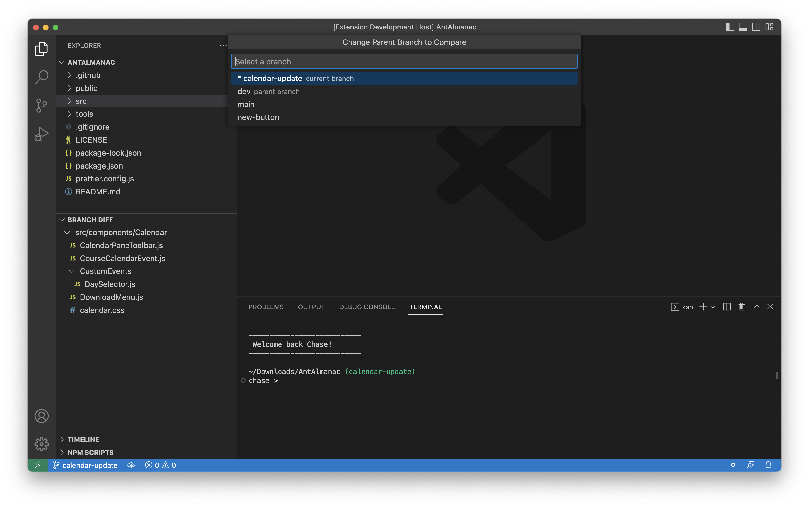

# Branch Diff VS Code Extension

An extension to show what files have changed compared to other branches.

This extension is perfect for when you frequently switch between feature branches and want to see what files you were previously working in on that branch.

## Features

- **Autodetect parent branch**  
`Branch Diff` will automatically detect the parent branch of your current branch and show what files have changed.

- **Manually select parent branch**  
By using the "Change Parent Branch" button, you can easily update which branch your current one is compared to.

- **Refreshes automatically on file change and branch change**  
The changed files should update automatically as you work. 
If anything falls out of sync, there is also a manual refresh button.

## Demo

## Release Notes

### 1.1
- Update parent branch automatically on branch change
- Add compact folders
- Add change log
- Improve marketing material (README, screenshots, etc.)

### 1.0
- Initial release of `Branch Diff`!
